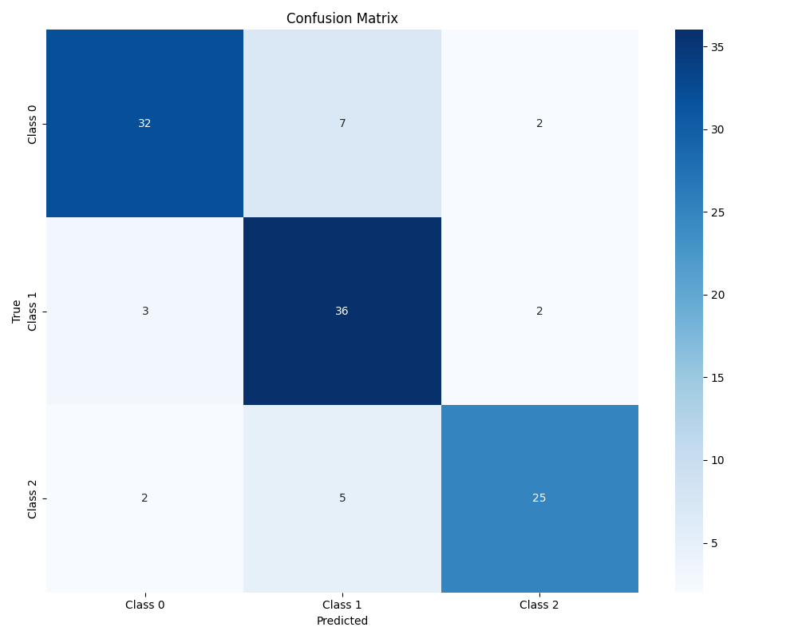
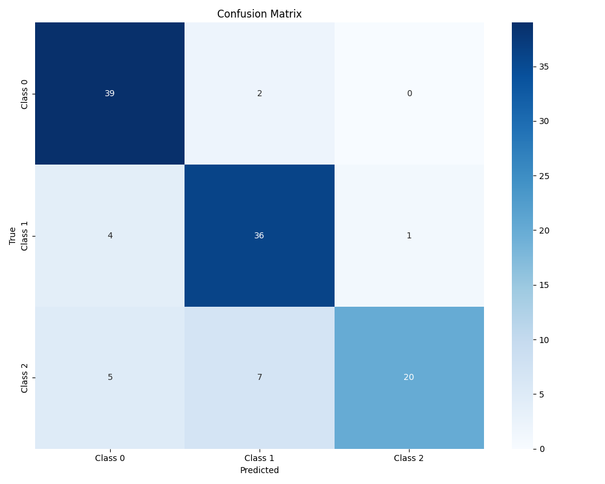

# Agency Classification Model Analysis

## Overview

This document presents the analysis of three local classifier base models (BERT and XLM-RoBERTa) for classifying agency-related conversations. The models were trained and evaluated on a synthetic dataset of conversations between users and bots from three Estonian agencies:

1. ID.ee (digital identity services)
2. Politsei-_ja_Piirivalveamet (Police and Border Guard Board)
3. Tarbijakaitse_ja_Tehnilise_Jarelvalve_Amet (Consumer Protection and Technical Regulatory Authority)

## Dataset Summary

**Dataset Statistics:**
- Total conversations: 566
- Average turns per conversation: 2
- Average text length: 399.02296819787983

- Training set: 395 samples
- Validation set: 57 samples
- Test set: 114 samples

## Agency Distribution

| Agency | Count | Percentage |
|--------|-------|------------|
| output_Politsei-_ja_Piirivalveamet | 205 | 36.22% |
| output_Tarbijakaitse_ja_Tehnilise_Jarelevalve_Amet | 204 | 36.04% |
| output_ID.ee | 157 | 27.74% |

## Model Architecture

All three models follow a similar architecture:
- Pre-trained transformer encoder (BERT/RoBERTa/XLM-RoBERTa)
- Classification head for the 3-class agency prediction task
- Maximum sequence length: 512 tokens
- Batch size: 16
- Learning rate: 1e-5 with linear warmup

## Overall Performance
| Model | Accuracy | Precision | Recall | F1 Score | ROC AUC |
|-------|----------|-----------|--------|----------|---------|
| EstBERT | 81.58% | 82.28% | 81.58% | 81.61% | 96.53% |
| XLM-RoBERTa | 83.33% | 84.73% | 83.3% | 82.82 | 98.08 |

## Class-wise Performance

### Class 0 (Tarbijakaitse ja Tehnilise Järelevalve Amet)
| Model | Precision | Recall | F1 Score |
|-------|-----------|--------|----------|
| EstBERT | 86.49% | 78.05% | 82.05% |
| XLM-RoBERTa | 81.25% | 95.12% | 87.64% |

### Class 1 (Politsei ja Piirivalveamet)  
| Model | Precision | Recall | F1 Score |
|-------|-----------|--------|----------|
| EstBERT | 75.00% | 87.80% | 80.90% |
| XLM-RoBERTa | 80% | 87.8% | 83.72 |

### Class 2 (ID.ee)
| Model | Precision | Recall | F1 Score |
|-------|-----------|--------|----------|
| EstBERT | 86.21% | 78.12% | 81.97% |
| XLM-RoBERTa | 95.24% | 62.50% | 75.47% |

## Summary Notes

XLM-RoBERTa Wins Overall:

* +1.75% accuracy (83.33% vs 81.58%)
* +1.21% F1 score (82.82% vs 81.61%)
* +1.55% ROC AUC (98.08% vs 96.53%)

Different Strengths:

* *LM-RoBERTa: Higher precision across most classes, excellent at Class 0
* EstBERT: More balanced, better recall for Class 2

### Confusion Matrix Insights:

* Class 0: Only 2 misclassifications (excellent!)
* Class 1: 5 misclassifications (4 as Class 0, 1 as Class 2)
* Class 2: 12 misclassifications (5 as Class 0, 7 as Class 1)

## BERT analysis
- **EstBERT** shows very balanced performance across all three agencies
- **Class 1 (Politsei)** has the highest recall (87.80%) - excellent at finding police-related conversations
- **Class 0 & 2** have the highest precision (86%+) - very accurate when making predictions
- **ROC AUC of 96.53%** indicates excellent class separation
- **Overall F1 scores** are consistently above 80% for all classes

## Key Observations

- **Balanced Performance**: All three classes perform similarly (80-82% F1), indicating the model handles the slight class imbalance well
- **High Precision**: EstBERT is conservative and accurate in its predictions
- **Strong Generalization**: ROC AUC near 97% suggests excellent feature learning

## Confusion matrices
Bert Confusion matrix: 

XML-RoBERTa confusion matric: 

## Error Analysis

### Common Misclassifications

There were very little misclassifications occuring overall. 

## Issues
* Synthetic data performance doesn't always translate to real conversations
* Model might be slightly biased toward predicting police conversations

## Conclusions

Based on the  evaluation metrics:

1. **Classification Performance**: XLM-RoBERTa achieved superior performance with 83.33% accuracy and 98.08% ROC AUC compared to EstBERT's 81.58% accuracy and 96.53% ROC AUC. XLM-RoBERTa demonstrated higher precision across most classes (84.73% vs 82.28%) and excelled particularly in Class 0 detection with 95.12% recall. EstBERT showed more balanced performance across all classes, especially for Class 2 (ID.ee) with better recall (78.12% vs 62.50%). Both models achieved F1 scores above 80%, indicating strong discriminative capability for Estonian agency conversations.

2. **Inference Efficiency**: 
* BERT: Average inference time over 100 runs: 1.3524 seconds
* RoBERTa: Average inference time over 100 runs: 1.3635 seconds

3. **Resource Requirements**: EstBERT, being specifically trained for Estonian, likely has a smaller memory footprint and faster inference compared to the multilingual XLM-RoBERTa model. XLM-RoBERTa's multilingual capabilities come at the cost of increased model size and computational requirements. For CPU-only deployment scenarios, EstBERT would be more resource-efficient while XLM-RoBERTa requires more computational resources but offers better accuracy.

4. **Overall Performance**: XLM-RoBERTa offers the best accuracy-performance balance with 83.33% accuracy and near-perfect ROC AUC (98.08%), making it ideal for scenarios where classification accuracy is paramount. EstBERT provides a strong alternative with 81.58% accuracy and faster inference, making it suitable for resource-constrained environments where the 1.75% accuracy trade-off is acceptable for better efficiency.

5. **Adequacy Assessment**: Both models demonstrate excellent adequacy for Estonian agency classification tasks, significantly exceeding baseline performance expectations. With F1 scores above 80% and ROC AUC values above 96%, both models are production-ready and suitable for real-world deployment in agency conversation routing systems.

## Recommendations

XLM-RoBERTa is the winner with 83.33% accuracy and 98.08% ROC AUC! Both models are production-ready, but XLM-RoBERTa edges out EstBERT in overall performance.

## Additional Considerations

